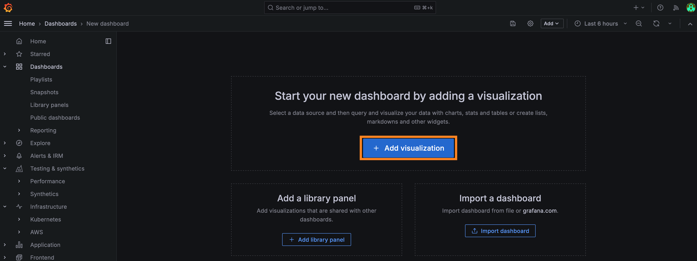

# Crowdedness Monitor

Every city has popular spots which can get crowded at unpredictable times. The crowdedness of a place, like how many people are at a study hall, in the office or at a park can be a major factor in deciding whether or not to go there. Information about crowdedness, however, is rarely available. Mi aim is to solve this by using smart sensors listening to wireless signals and noise level to help determine how crowded a place is. With this information, one can decided for example if going to the university building to study makes sense, on which workday is the office least crowded, or what to expect when going to the park.

## Sensor overview

To estimate the crowdedness of a place, I decided to use three data points:
 - Noise level
 - Nearby WiFi devices
 - Nearby Bluetooth devices

My aim is to provide a prototype that works in several environments. For indoor places which people regularly visit, WiFi device data can be a good predictor as people connect their smartphones/laptops to the local network. For small places like cafés, noise level could correlate with crowdedness too. I chose to detect Bluetooth devices as most people leave bluetooth on on their phones (e.g. to listen to music with wireless headsets) and scanning for Bluetooth devices could be one way of measuring crowdedness in outdoor public places like parks or other places without open WiFi networks. 

Sending this data over LTE offers independence from WiFi which most IoT devices rely on. To increase fault tolerance, I have opted to include a battery in the Smart Sensor to enable operation in remote places with intermittent power or even without power (e.g. a solar panel could be used to recharge the built-in battery).

## Bill Of Materials

The following components are needed to build the sensor:
 1. AVR-IoT Cellular Mini - this is the brain of the sensor, measuring noise levels and sending all data to the cloud using the built-in cellular modem
 2. ESP32, for this project, a LOLIN32 lite board - the microcontroller used to keep track of the number of nearby WiFi and Bluetooth devices
 3. Microphone module - for measuring the ambient noise level
 4. Toggle switch
 5. TP4056 LiPo battery charger
 6. 2.54mm 40pin female header (x2)
 7. 2.54mm 4pin female header with longer leads
 8. Wires
 9. 2000mAh LiPo battery (other capacity works too)
 10. 2x male and 1x female micro jst connectors
 11. M2.5 screws (4x)
 12. 70x90mm prototyping board

The components needed for the Smart Sensor can be seen in the figure below:

<p align="center"></p>

## Hardware assembly

Before starting to assemble the hardware, the first step should to activate the SIM card for the AVR-IoT Cellular Mini and test that it successfully connects to Microchip Sandbox. For that, follow this Hackster guide: [https://www.hackster.io/keenan-johnson/avr-iot-cellular-mini-107a63](https://www.hackster.io/keenan-johnson/avr-iot-cellular-mini-107a63)
If everything works, solder the headers onto the board and get start assembling the sensor.

The schematic for wiring the components is shown below:

<p align="center"></p>

The pinout for the ESP32 and AVR-IoT Cellular Mini boards are available here:
 - https://www.microchip.com/en-us/development-tool/ev70n78a
 - https://mischianti.org/esp32-wemos-lolin32-lite-high-resolution-pinout-and-specs/

Apart from the ground connection, the two microcontrollers are connected via a Serial RX-TX pair and an other GPIO connection. This can be used in case of an optional battery saving mode to wake up the ESP32. GPIO4 was chosen on the ESP32-side since it is an RTC pin, so it can be used to wake up the microcontroller. The other two pins for the serial connection were chosen from the ones that had no limitations. A good guide on what pins to use on an ESP32 can be found here: [https://randomnerdtutorials.com/esp32-pinout-reference-gpios/]( https://randomnerdtutorials.com/esp32-pinout-reference-gpios/).

To make everything fit inside the custom casing I designed, I wired up the major components on a perfboard according to the layout below:

<p align="center"></p>

Every wire is connected to the pin on the female header next to it. The green wires are the serial connection, blue is ground, red is 3.3V, white is the sound sensor's output and brown in the wakeup signal for the ESP32. I have also cut a hole on the right side to the perfboard in order to pass the battery wires through. After soldering the connections on the back of the perfboard, the components can be placed in their slots:

<p align="center"></p>

The entire perfboard, along with the battery fits inside the casing I designed:

<p align="center"></p>

The STL files for the top and bottom parts are available [here](./3dfiles/case-top.stl) and [here](./3dfiles/case-bottom.stl). There are cutouts for the switch, the LiPo charging board and the microphone. I opted to include a separate charger besides the one onboard the AVR-IoT Cellular Mini board in order to be able to charge the battery while everything else is powered down. As can be seen on the schematic and on the image below too, the battery is connected to the TP4056's battery terminals through the female micro JST connector and the male micro JST connectors are connected to the protected output of the LiPo charging board through the switch. **Make sure to check if the polarity of the JST connectors is correct!** The ones I have had reverse polarity which could have damaged both microcontrollers if I hadn't noticed that. I have used a tweezer to remove the two wires from the plastic connector and then swapped them.

<p align="center"></p>

After soldering the wires together, the charger can be hot glued into place to the bottom of the case and the switch can be secured from the outside with a nut or a keycap.

<p align="center"></p>

Then the perfboard can be placed inside the 3D-printed enclosure and secured witch screws. Removing the microcontrollers beforehand allows easier access to the holes for the M2.5 screws. The battery cables should also be connected to the microcontrollers afterwards.

<p align="center"></p>

When assembled, the smart sensor looks like this:

<p align="center"></p>

Let's write the software next.

## Software

The software can be divided into three parts:
 - Cloud data storage
 - Device firmware
 - Data visualization and presentation

All three steps are important and necessary to create a smart and useful sensor. For storing data in the cloud, I opted to use InfluxDB, a time-series database. It has a free, managed option as well as paid and self-hosted options making it suitable for several scenarios. In this guide, I will show how to use the InfluxDB's cloud solution. For writing the device firmwares, I used the Arduino IDE. Finally, for data visualization, I used Grafana.

### InfluxDB

To get started with InfluxDB, the first step is to register for a free serverless cloud account at [https://www.influxdata.com](https://www.influxdata.com):

<p align="center"></p>

After registering, create a new bucket named **sensordata**:

<p align="center"></p>

On the free plan, the maximum retention period is 30 days. The next step is to generate access tokens. Firstly, generating one for the AVR-IoT Cellular Mini with read and write access to the sensordata bucket:

<p align="center"></p>

The other token will provide read-only access to the data through Grafana:

<p align="center"></p>

For now, store the generated tokens. The first one will need to be pasted in the arduino code, while the other will be needed during the Grafana setup.

### ESP32

The ESP32's responsibility is collecting WiFi and Bluetooth device data, more specifically, the number of unique devices nearby. For listening to WiFi messages,the ESP32 has a so-called promiscuous mode. I have used [this](https://www.hackster.io/p99will/esp32-wifi-mac-scanner-sniffer-promiscuous-4c12f4) Hackster guide as a basis on how to run promiscuous mode on the ESP32. For nearby bluetooth devices, the ESP32 can scan passively or actively for nearby BLE devices. A good approach I found for this was in [this](https://github.com/dollop80/ESP32-BLE-Scanner/blob/master/ESP32_BLE_Scanner.ino) GitHub repo.

An important limitation is that WiFi and BLE share the same radio on the ESP32, so only one can ran at a time. For WiFi, the ESP32 can only be tuned to a single 2.4GHz channel out of the 14 available. This means that in order to get an accurate count of nearby devices, we need to alternate between scanning on different WiFi channels and for BLE devices. Let's see how it can be done. The full source code is available [here](./esp32.ino). 

The first part is the includes, followed by increasing the main loop task's stack size from 8KB to 32KB.

```c
#include <Arduino.h>
#include <BLEDevice.h>
#include <BLEUtils.h>
#include <BLEScan.h>
#include <BLEAdvertisedDevice.h>
#include <WiFi.h>
#include "esp_wifi.h"

SET_LOOP_TASK_STACK_SIZE(32 * 1024)
```

The next step is to define a what the ESP32 will filter for when listening to WiFi packets. Additionally, two structs are defined, which are needed to interface with the low-level parts of the WiFI packet callback.

```c
const wifi_promiscuous_filter_t filt={
    .filter_mask=WIFI_PROMIS_FILTER_MASK_MGMT|WIFI_PROMIS_FILTER_MASK_DATA
};

typedef struct {
  uint8_t mac[6];
} __attribute__((packed)) MacAddr;

typedef struct {
  int16_t fctl;
  int16_t duration;
  MacAddr da;
  MacAddr sa;
  MacAddr bssid;
  int16_t seqctl;
  unsigned char payload[];
} __attribute__((packed)) WifiMgmtHdr;
```

Next, we define the maximum channel number that the ESP32 will scan. For me in the EU, this channel is 13:

```c
#define MAX_WIFI_CHANNEL 13 //max channel for scanning -> US = 11, EU = 13, Japan = 14
```

This is followed by defining the number of unique devices we aim to track at most. To get an accurate view of the number of devices, their MAC addresses will be extracted from the scan results and then cached for 6 minutes (as set by `DEVICE_TTL_MS`) in order to not count a device twice. WiFi and BLE addresses are stored separately. The `Device` struct not only stores the 6-byte MAC address, but also the last time the device was seen and whether the MAC address is considered a nearby device (it was seen recently) or not and a new device's MAC address can be placed at that slot.

```c
#define DEVICE_BUFFER_SIZE 1024
#define DEVICE_TTL_MS 360000 // 6 minutes

typedef struct {
  uint8_t mac[6];
  long lastms = 0;
  bool alive = false;
} Device;

Device wifiDevices[DEVICE_BUFFER_SIZE];
Device bleDevices[DEVICE_BUFFER_SIZE];
```

The last statements before the methods define the GPIOs used for the serial communication with the AVR-IoT Cellular Mini and the deep sleep wakeup pin. Finally, a counter is defined to keep track of the number of times a full scanning round has been executed.

```c
#define RXD2 22
#define TXD2 19
#define WAKEUP_PIN GPIO_NUM_4 // GPIO 4 - RTC_GPIO10

long scanRoundCount = 0;
```

The first method we need to define will handle placing new devices in one of the two buffers. 

```c
void registerDevice(uint8_t mac[6], bool isWiFi){
  for(int i = 0; i < DEVICE_BUFFER_SIZE; i++){
    if(isWiFi && wifiDevices[i].alive && memcmp(mac, wifiDevices[i].mac,6) == 0){
      // Existing device, increase ttl
      wifiDevices[i].lastms = millis();
      wifiDevices[i].alive = true;
      return;
    }else if(!isWiFi && bleDevices[i].alive && memcmp(mac, bleDevices[i].mac,6) == 0){
      // Existing device, increase ttl
      bleDevices[i].lastms = millis();
      bleDevices[i].alive = true;
      return;
    }
  }
  // New device
  for(int i = 0; i < DEVICE_BUFFER_SIZE; i++){
    if(isWiFi && !wifiDevices[i].alive){
      memcpy(wifiDevices[i].mac, mac, 6);
      wifiDevices[i].lastms = millis();
      wifiDevices[i].alive = true;
      Serial.printf("[WIFI] NEW MAC: %02X:%02X:%02X:%02X:%02X:%02X\n", mac[0], mac[1], mac[2], mac[3], mac[4], mac[5]);
      return;
    } else if(!isWiFi && !bleDevices[i].alive){
      memcpy(bleDevices[i].mac, mac, 6);
      bleDevices[i].lastms = millis();
      bleDevices[i].alive = true;
      Serial.printf("[BLE ] NEW MAC: %02X:%02X:%02X:%02X:%02X:%02X\n", mac[0], mac[1], mac[2], mac[3], mac[4], mac[5]);
      return;
    }
  }
  Serial.printf("Buffer is full, no place for MAC: %02X:%02X:%02X:%02X:%02X:%02X\n", mac[0], mac[1], mac[2], mac[3], mac[4], mac[5]);
}
```

If an existing device is alive (i. e. it has been seen recently) and matches the MAC address (`memcmp(mac, wifiDevices[i].mac,6) == 0`) then its last seen time (`lastms`) is updated. Otherwise, the device's MAC address is placed into the first free slot of the device buffer. Additionally, when a new MAC address is discovered, it is printed to the serial output, so it can be seen from the Arduino IDE's serial monitor (`[WIFI] NEW MAC: AA:AA:AA:AA:AA:AA`). If the buffer is full, the MAC address is ignored.

The next method is responsible for marking the entries outside the TTL interval (as defined by `DEVICE_TTL_MS`) as not alive. This means that these devices won't be included in the total nearby devices count and their slot can be taken up by other new devices discovered.

```c
void cleanupDevices(){
  for(int i = 0; i < DEVICE_BUFFER_SIZE; i++){
    if(wifiDevices[i].alive && millis() - wifiDevices[i].lastms > DEVICE_TTL_MS){
      Serial.printf("[WIFI] REMOVED MAC: %02X:%02X:%02X:%02X:%02X:%02X\n", wifiDevices[i].mac[0], wifiDevices[i].mac[1], wifiDevices[i].mac[2], wifiDevices[i].mac[3], wifiDevices[i].mac[4], wifiDevices[i].mac[5]);
      wifiDevices[i].alive = false;
    }
    if(bleDevices[i].alive && millis() - bleDevices[i].lastms > DEVICE_TTL_MS){
      Serial.printf("[BLE ] REMOVED MAC: %02X:%02X:%02X:%02X:%02X:%02X\n", bleDevices[i].mac[0], bleDevices[i].mac[1], bleDevices[i].mac[2], bleDevices[i].mac[3], bleDevices[i].mac[4], bleDevices[i].mac[5]);
      bleDevices[i].alive = false;
    }
  }
}
```

In order to count the number of unique BLE and WiFi devices nearby, we just need to loop through the buffers and count how many devices are alive:

```c
int countWiFiDevices(){
  int cnt = 0;
  for(int i = 0; i < DEVICE_BUFFER_SIZE; i++){
    if(wifiDevices[i].alive) cnt++;
  }
  return cnt;
}
int countBleDevices(){
  int cnt = 0;
  for(int i = 0; i < DEVICE_BUFFER_SIZE; i++){
    if(bleDevices[i].alive) cnt++;
  }
  return cnt;
}
```

The next function is the handler for the event when a new WiFi packet (frame) is captured:

```c
void wifiSniffer(void* buf, wifi_promiscuous_pkt_type_t type) {
  wifi_promiscuous_pkt_t *p = (wifi_promiscuous_pkt_t*)buf;
  int len = p->rx_ctrl.sig_len;
  WifiMgmtHdr *wh = (WifiMgmtHdr*)p->payload;
  len -= sizeof(WifiMgmtHdr);
  if (len < 0){
    Serial.println("Received 0");
    return;
  }
  uint8_t mac[6];
  for(int i=4;i<10;i++){
    mac[i-4] = p->payload[i];
  }
  registerDevice(mac, true);
}
```

The first part of the functions is responsible for getting the data and some sanity checks. A WiFi frame can have up to four MAC addresses ([https://howiwifi.com/2020/07/13/802-11-frame-types-and-formats/](https://howiwifi.com/2020/07/13/802-11-frame-types-and-formats/)), however, we are only interested in the first one: the source. It starts at byte 4 and is 6 bytes long. The latter part of the function extracts this information from the packet and calls the `registerDevice()` function we wrote earlier.

A slightly different approach is required when defining the callback for the BLE scan:

```c
class MyAdvertisedDeviceCallbacks : public BLEAdvertisedDeviceCallbacks{
    void onResult(BLEAdvertisedDevice advertisedDevice){
      registerDevice(advertisedDevice.getAddress().getNative()[0], false);
    }
};
```

Here, we create a derived class from `BLEAdvertisedDeviceCallbacks`, overriding the `onResult()` functions where we call the already mentioned `registerDevice()` function.

The next function is the setup function:

```c
MyAdvertisedDeviceCallbacks* cb;

void setup() {
  Serial.begin(115200);
  Serial2.begin(115200, SERIAL_8N1, RXD2, TXD2);
  WiFi.persistent(false);
  Serial.printf("Startup complete. Free stack: %d\n",uxTaskGetStackHighWaterMark(NULL));
  cb = new MyAdvertisedDeviceCallbacks();
}
```

Here, the two serial ports are initialized with a baud rate of 115200. Serial2 is the one which will be used for communication with the AVR-IoT Cellular Mini. Persisting WiFi configuration changes is also turned off (though it is off by default on more recent Arduino ESP32 library versions) to prevent writing to the flash storage. The last step is creating an instance of the BLE callback we will use later.

The function below is the main logic for WiFi scanning. The promiscuous mode is turned on, the packet filter is applied and the the WiFi frame callback is set to our `wifiSniffer()` function defined earlier. Then the listening starts at channel 1 for 2 seconds, then the next channel and so on until `MAX_WIFI_CHANNEL`. Then the wifi listening is stopped and the wifi configuration is deinitialised. This is needed to enable BLE scanning.
```c
void performWifiScan(){
  Serial.println("WiFi scan start");
  wifi_init_config_t cfg = WIFI_INIT_CONFIG_DEFAULT();
  esp_wifi_init(&cfg);
  esp_wifi_set_storage(WIFI_STORAGE_RAM);
  esp_wifi_set_mode(WIFI_MODE_NULL);
  esp_wifi_set_promiscuous(true);
  esp_wifi_set_promiscuous_filter(&filt);
  esp_wifi_set_promiscuous_rx_cb(&wifiSniffer);
  esp_wifi_set_channel(1, WIFI_SECOND_CHAN_NONE);
  esp_wifi_start();
  for(int channel = 1; channel <= MAX_WIFI_CHANNEL; channel++){
    esp_wifi_set_channel(channel, WIFI_SECOND_CHAN_NONE);
    vTaskDelay(2000 / portTICK_PERIOD_MS); // 2s delay
  }
  esp_wifi_stop();
  esp_wifi_deinit();
  Serial.println("WiFi scan end");
}
```

The BLE scanning function is shown below. First, the Bluetooth LE is initialized, a scan object is created and the scan parameters are set: our callback function, passive scan mode and the scan intervals. Then an asynchronous scan is started for 6 seconds. It is then interrupted 1 second before finishing. This is a workaround, as the synchronous call would result in the ESP32 running out of heap space (`__cxa_allocate_exception`) when trying to construct the data to return when there are a lot of nearby devices. I discovered this issue when I was collecting data in a multi-storey office building.

```c
void performBleScan() {
  Serial.println("BLE scan start");
  BLEDevice::init("");
  BLEScan *pBLEScan = BLEDevice::getScan(); //create new scan
  pBLEScan->setAdvertisedDeviceCallbacks(cb);
  pBLEScan->setActiveScan(false); //active scan uses more power, but get results faster
  pBLEScan->setInterval(0x100);
  pBLEScan->setWindow(0x100);
  pBLEScan->start(6, nullptr, false); // scan for 6 seconds, ignoring return value
  vTaskDelay(5000 / portTICK_PERIOD_MS); // 5s delay
  pBLEScan->stop();
  Serial.printf("BLE scan end. Free stack: %d heap: %d\n", uxTaskGetStackHighWaterMark(NULL), ESP.getFreeHeap());
  pBLEScan->clearResults();
  BLEDevice::deinit(false);
}
```

The final part is clearing the results and deinitialising the BLE driver. Here, the `deinit()` function's parameter determines whether or not to free up the memory allocated to the BLE driver. It has to be set to `false` otherwise the BLE stack cannot be initialized again without resetting the ESP32.

The final function is the main loop:

```c
void loop() {
  performWifiScan();
  performBleScan();
  Serial.printf("WIFI Device count: %d BLE: %d Free heap: %d Free stack: %d\n", countWiFiDevices(), countBleDevices(), ESP.getFreeHeap(), uxTaskGetStackHighWaterMark(NULL));
  scanRoundCount++;
  if(scanRoundCount >= 3){
    // Device list has stabilized over multiple rounds of scans
    Serial.println("Sending data to AVR IOT CELLULAR MINI...");
    Serial2.printf("%d,%d,%d\n", countWiFiDevices(), countBleDevices(), ESP.getFreeHeap());
  }
  cleanupDevices();
  delay(100);
  if(Serial2.available()){
    String command = Serial2.readStringUntil('\n');
    if(command.startsWith("SLEEP")){
      Serial.println("Going to sleep...");
      esp_sleep_enable_ext0_wakeup(WAKEUP_PIN, HIGH);
    }else{
      Serial.printf("Message received: %s\n", command);
    }
  }
}
```

Here, firstly WiFi then BLE scanning is performed. Then if there have been a couple of round of scans, the data is sent to the AVR-IoT Cellular Mini which will publish this information to the InfluxDB storage. The device cleanup is also called, followed by checking the Serial2 connection whether a sleep command has been issued by the other microcontroller.

With this, the code to run on the ESP32 is complete. The full source code is available [here](./esp32.ino). To upload it, select ESP32 dev module as the device, choose the right serial port and set the partition scheme to Huge APP:

<p align="center"></p>

After uploading, you should see something the output below on the Arduino serial monitor:
```
WiFi scan start
[WIFI] NEW MAC: AA:AA:AA:AA:AA:AA
[WIFI] NEW MAC: BB:BB:BB:BB:BB:BB
WiFi scan end
BLE scan start
[BLE ] NEW MAC: CC:CC:CC:CC:CC:CC
[BLE ] NEW MAC: DD:DD:DD:DD:DD:DD
[BLE ] NEW MAC: EE:EE:EE:EE:EE:EE
BLE scan end. Free stack: 30852 heap: 79508
WIFI Device count: 106 BLE: 77 Free heap: 168216 Free stack: 30852
Sending data to AVR IOT CELLULAR MINI...
[WIFI] REMOVED MAC: 88:88:88:88:88:88
```

Keep in mind that the ESP32 only has a 2.4GHz radio, so devices connecting to access points' 5GHz channels won't be visible.

The next step is to write the code to run on the AVR-IoT Cellular Mini.

### AVR-IoT Cellular Mini

To set up Arduino ide for the board, please follow the steps outlined on Microchip's website: [https://iot.microchip.com/docs/arduino/introduction/devenv](https://iot.microchip.com/docs/arduino/introduction/devenv).

Since we will be using HTTPS to communicate with InfluxDB, the root certificate for Let's Encrypt needs to be loaded to the board. For that, flash the Provision sketch ([https://github.com/microchip-pic-avr-solutions/avr-iot-cellular-arduino-library/blob/main/examples/provision/provision.ino](https://github.com/microchip-pic-avr-solutions/avr-iot-cellular-arduino-library/blob/main/examples/provision/provision.ino)) to the board and then select HTTP provisioning, then TLS 1.3 and finally opt to upload a custom CA certificate:

```
========= Provisioning for AVR-IoT Cellular Mini =========
Note: Please use PuTTY or an equivalent serial terminal for provisioning as especially the serial monitor in Arduino IDE 2 does not handle inputting multi-line strings well.
Method to provision
1: MOTT
2: HTTP
Please choose (press enter when done): 2

Which TLS version do you want to use?
1: TLS 1
2: TLS 1.1
3: TLS 1.2 (default)
4: TLS 1.3
Please choose (press enter when done): 4

Do you want to load a custom certificate authority certificate?
Please choose (y/n). Press enter when done: y

Please paste in the CA certificate and press enter. It should be on the following form:
-----BEGIN CERTIFICATE-----
MIIDXTCCAkWgAwIBAgIJAJC1[...]j3tCx2IUXVqRs5mlSbvA==
-----END CERTIFICATE-----

```

Then paste the contents of the PEM file corresponding to Let's Encrypt's ISRG Root X1 available here: [https://letsencrypt.org/certs/isrgrootx1.pem](https://letsencrypt.org/certs/isrgrootx1.pem).

After the certificate has been saved, press enter and the process is complete. Next, let's look at what the code running on the AVR IoT Cellular Mini should do.

The first part is including the relevant libraries and defining the important constants. Enter the read-write influx token generated earlier to the `INFLUX_TOKEN` string. 

```c

#include <Arduino.h>
#include <http_client.h>
#include <led_ctrl.h>
#include <log.h>
#include <lte.h>
#include <low_power.h>


#define INFLUX_TOKEN "<<<ENTER_INFLUX_TOKEN_HERE>>>"
#define INFLUX_ORG "<<<ENTER_INFLUX_ORG_ID_HERE>>>"

#define INFLUX_HEADER "Authorization: Token " INFLUX_TOKEN

#define INFLUX_URL "eu-central-1-1.aws.cloud2.influxdata.com"
#define INFLUX_ENDPOINT "/api/v2/write?org=" INFLUX_ORG "&bucket=sensordata&precision=s"
#define DEVICE_TAG "AVR_IOT"
```

For setting the `INFLUX_URL` and `INFLUX_ORG` strings, check InfluxDB's organization settings for the Cluster URL and Organization ID values:

<p align="center"></p>

If you plan on adding more than one Smart Sensor, the `DEVICE_TAG` value can be used to distinguish between them. 

The next part of the code is defining the pins for the ESP32 wakeup, the analog microphone input and defining the period of data transmission to the cloud:

```c
#define ESP_WAKEUP_PIN PIN_PE2 // D5
#define MIC_PIN PIN_PD6 // A0

#define DATA_SEND_INTERVAL 180000 // 3 minutes
```

Then some global variables are defined:

```c
long lastSentTime = 0; // The last time data was sent to the cloud

#define NOISE_BUFFER_SIZE 64 // buffer for storing history of noise levels:
int noiseValues[] = {0,0,0,0,0,0,0,0,0,0,0,0,0,0,0,0,0,0,0,0,0,0,0,0,0,0,0,0,0,0,0,0,0,0,0,0,0,0,0,0,0,0,0,0,0,0,0,0,0,0,0,0,0,0,0,0,0,0,0,0,0,0,0,0};
int noiseWriteIdx = 0; // index for the circular buffer above

// Storing serial messages from ESP32:
int lastWiFiDeviceCount = 0;
int lastBleDeviceCount = 0;
long lastEspHeapInfo = 0;
long lastDataUpdateFromESP = 0;
```

I have tried to set up the USART2 pins (RX, TX on the header) to use hardware serial, but I could not get it to work, so I use software serial for these pins as seen below:

```c
#include <SoftwareSerial.h> // For some reason, the hardware serial did not work
SoftwareSerial mySerial(PIN_PF5, PIN_PF4); // RX TX
```

Let's look at the functions defined next. The first one is responsible for sending the data to the cloud:

```c
void sendData(){
    int noisemax = noiseValues[0];
    int noisemin = noiseValues[0];
    double noisemean = noiseValues[0];
    for(int i = 1; i < NOISE_BUFFER_SIZE; i++) {
      noisemax = max(noisemax, noiseValues[i]);
      noisemin = min(noisemin, noiseValues[i]);
      noisemean += noiseValues[i];
    }
    noisemean /= NOISE_BUFFER_SIZE;
    char data[256];
    if(millis()-lastDataUpdateFromESP < DATA_SEND_INTERVAL) {
      // New data from ESP32
      sprintf(data, "noise,device=%s noise-mean=%.1f,noise-max=%di,noise-min=%di\npower,device=%s voltage=%.2f\nwireless,device=%s ble-devices=%di,wifi-devices=%di,esp-free-heap=%ldi", 
      DEVICE_TAG, noisemean, noisemax, noisemin, DEVICE_TAG, (double) LowPower.getSupplyVoltage(), DEVICE_TAG, lastBleDeviceCount, lastWiFiDeviceCount, lastEspHeapInfo);
    }else{
      Log.infof(F("Skipping sending ESP data as there is no recent one available!\n"));
      sprintf(data, "noise,device=%s noise-mean=%.1f,noise-max=%di,noise-min=%di\npower,device=%s voltage=%.2f", DEVICE_TAG, noisemean, noisemax, noisemin,DEVICE_TAG, (double) LowPower.getSupplyVoltage());
    }
    
    Log.infof(F("Sending data:\n%s\n"),data);
    HttpResponse response = HttpClient.post(INFLUX_ENDPOINT, data, INFLUX_HEADER);

    Log.infof(F("POST - HTTP status code: %u, data size: %u\n"),
              response.status_code,
              response.data_size);
}
```

The function calculates the mean, minimum and maximum noise levels from the circular buffer (`noiseValues`) storing the history of recent noise levels. Then the message is assembled to the `data` character array. Each line of the string is a measurement. Let's see the structure of a single line: `noise,device=AVR_IOT noise-mean=4.1,noise-max=12i,noise-min=1i`. Here, `noise` is the measurement name, followed by a comma. Then a tag (`device`) is set, followed by a space. After the space, the measurements are set as key-value pairs separated by commas. More details about the line protocol are available on InfluxDB's website ([https://docs.influxdata.com/influxdb/cloud/get-started/write/#line-protocol-element-parsing](https://docs.influxdata.com/influxdb/cloud/get-started/write/#line-protocol-element-parsing)). Apart from the noise measurement, there is a power measurement too (`power,device=AVR_IOT voltage=4.12`) sending the board's supply voltage to the cloud utilizing `LowPower.getSupplyVoltage()` ([https://iot.microchip.com/docs/arduino/userguide/low_power#retrieving-the-current-supply-voltage](https://iot.microchip.com/docs/arduino/userguide/low_power#retrieving-the-current-supply-voltage)). If there is recent data available from the ESP32, it is also included in the measurements (`wireless,device=AVR_IOT ble-devices=45i,wifi-devices=66i,esp-free-heap=154321i`). After the body of the request is assembled, the POST request is sent. If everything went well, the response code should be **204**.

For measuring the sound/noise level, I opted to measure the amplitude of the AC sound signal output by the microphone board. That is achieved by measuring the minimum and maximum ADC voltage levels over several (50000) samples:

```c
int getSoundLevel(){
  int l_min;
  int l_max;
  int val = l_min = l_max = analogRead(MIC_PIN);
  for(unsigned int i = 0; i < 50000; i++){
    val = analogRead(MIC_PIN);
    l_min = min(l_min,val);
    l_max = max(l_max, val);
  }
  // Log.infof(F("Sound max: %d min: %d\n"), l_max, l_min);
  return l_max-l_min;
}
```
The level is the difference of these two values. 

The next function is setup, where the serial ports, the GPIOs and the LTE modem are initialized. The Http client's remote address is also set up:

```c
void setup() {
    LedCtrl.begin();
    LedCtrl.startupCycle();
    pinConfigure(ESP_WAKEUP_PIN, PIN_DIR_OUTPUT);
    digitalWrite(ESP_WAKEUP_PIN, HIGH);
    mySerial.begin(115200);
    mySerial.println("Hello!");

    Log.begin(115200);
    Log.info(F("Starting HTTPS with header example"));

    // Start LTE modem and connect to the operator
    if (!Lte.begin()) {
        Log.error(F("Failed to connect to the operator"));
        return;
    }

    Log.infof(F("Connected to operator: %s\r\n"), Lte.getOperator().c_str());

    if (!HttpClient.configure(INFLUX_URL, 443, true)) {
        Log.info(F("Failed to configure https client\r\n"));
        return;
    }

    analogRead(MIC_PIN); //A0
    digitalWrite(ESP_WAKEUP_PIN, LOW);
}
```

The main loop is the following:

```c
void loop() {
  float voltage = LowPower.getSupplyVoltage();
  int soundLevel = getSoundLevel();
  noiseValues[noiseWriteIdx] = soundLevel;
  noiseWriteIdx = (noiseWriteIdx+1)%NOISE_BUFFER_SIZE;
  
  if(noiseWriteIdx == 0) {
    Log.infof(F("   Voltage: %f noise level: %d\n"), voltage, soundLevel);
  }

  if(mySerial.available()){
    String data = mySerial.readStringUntil('\n');
    // Format: <num_wifi_devices>,<num_ble_devies>,<esp_free_heap>
    int firstComma = data.indexOf(",");
    int secondComma = data.indexOf(",",firstComma+1);
    int numWifiDevices = data.substring(0,firstComma).toInt();
    int numBleDevices = data.substring(firstComma+1, secondComma).toInt();
    long espFreeHeap = data.substring(secondComma+1).toInt();
    Log.infof(F("    Data from ESP32 #WIFI: %d #BLE: %d free heap: %ld\n"), numWifiDevices, numBleDevices, espFreeHeap);
    lastWiFiDeviceCount = numWifiDevices;
    lastBleDeviceCount = numBleDevices;
    lastEspHeapInfo = espFreeHeap;
    lastDataUpdateFromESP = millis();

  }
  
  if(millis()-lastSentTime > DATA_SEND_INTERVAL){
    sendData();
    lastSentTime = millis();
  }

  delay(100);
}
```

First, the noise level is recorded to the circular buffer. Then, if data is available from the ESP32, it is stored internally. Finally, if 3 minutes (`DATA_SEND_INTERVAL`) have passed since the last message to the cloud, the data is sent to InfluxDB via the LTE modem. Since IoT data plans are relatively expensive (measured in MB instead of in GB as regular cellular data plans), I opted to send all data (noise, power and wireless measurement) in one request every 3 minutes to save data usage.

After uploading the code to the AVR-IoT Cellular Mini using the Arduino IDE's **Upload Using Programmer** option, the logs defined in the functions should be seen on the serial output. The important part to look out for is the data sending part, first executed 3 minutes after startup:

```
[INFO]    Voltage: 4.851613 noise level: 2
[INFO] Sending data: 
noise,device=AVR_IOT noise-mean=2.0,noise-max=2i,noise-min=2i
power,device=AVR_IOT voltage=4.85
wireless,device=AVR_IOT ble-devices=81i,wifi-devices=88i,esp-free-heap=164564i
[INFO] POST - HTTP status code: 204, data size: 0
```

The full source code is available [here](./avr_iot.ino).

Now that the data sending is complete, let's visualize the collected data.

### Grafana

With Grafana, [https://grafana.com/](https://grafana.com/) it is really easy to make nince visulizations for our data. The first step is to register a free Grafana account. A great guide is available here: [https://grafana.com/docs/grafana-cloud/quickstart/](https://grafana.com/docs/grafana-cloud/quickstart/). When first launching your Grafana instance, opt to set up an InfluxDB datasource:

<p align="center"></p>

Select Flux as the query language, set the URL for the InfluxDB instance and populate the InfluxDB credentials: organization name, the read-only token generated earlier and the default bucket. Afterwards, save it and you should see a small popup confirming it works. Then go to the dashboards and select to create a new one:

<p align="center"></p>

Then click to add a new visualization:

<p align="center"></p>

You should add two queries to the panel:

```
from(bucket: "sensordata")
  |> range(start: v.timeRangeStart, stop:v.timeRangeStop)
  |> filter(fn: (r) =>
    r._measurement == "wireless" and r._field == "ble-devices"
  )
  |> aggregateWindow(every: $__interval, fn: mean)
```

and 

```
from(bucket: "sensordata")
  |> range(start: v.timeRangeStart, stop:v.timeRangeStop)
  |> filter(fn: (r) =>
    r._measurement == "wireless" and r._field == "wifi-devices"
  )
  |> aggregateWindow(every: $__interval, fn: mean)
```

You can set the title of the dashboard (`Wireless devices count`) on the right sidebar. Then click the blue Apply button and press save:

<p align="center"></p>

The first panel is ready! Let's add an other one for the noise levels using the following Flux queries:
```
from(bucket: "sensordata")
  |> range(start: v.timeRangeStart, stop:v.timeRangeStop)
  |> filter(fn: (r) =>
    r._measurement == "noise" and r._field == "noise-mean"
  )
  |> aggregateWindow(every: $__interval, fn: mean)
```

```
from(bucket: "sensordata")
  |> range(start: v.timeRangeStart, stop:v.timeRangeStop)
  |> filter(fn: (r) =>
    r._measurement == "noise" and r._field == "noise-max"
  )
  |> aggregateWindow(every: $__interval, fn: mean)
```

```
from(bucket: "sensordata")
  |> range(start: v.timeRangeStart, stop:v.timeRangeStop)
  |> filter(fn: (r) =>
    r._measurement == "noise" and r._field == "noise-min"
  )
  |> aggregateWindow(every: $__interval, fn: mean)
```

Let's add an other panel for the supply voltage:

```
from(bucket: "sensordata")
  |> range(start: v.timeRangeStart, stop:v.timeRangeStop)
  |> filter(fn: (r) =>
    r._measurement == "power" and r._field == "voltage"
  )
  |> aggregateWindow(every: $__interval, fn: mean)
```

Your final dashboard should look someting like this:

<p align="center"></p>

PS. don't forget to save your dashboard! That's it. The monitoring-side is complete. In the next section, I will show how well the three metric collected correlate with the crowdedness of different places.

## Measurements


